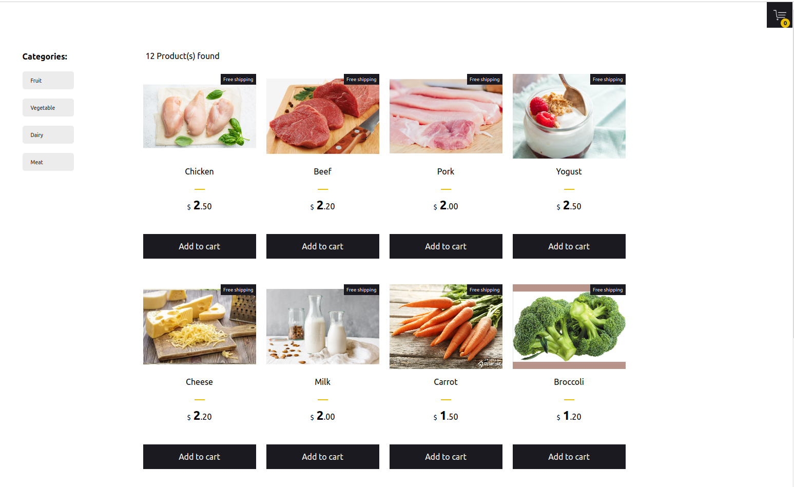

<p align="center">

  
</p>

This simple shopping cart prototype shows how React with Typescript, React hooks, react Context and Styled Components can be used to build a friendly user experience with instant visual updates and scaleable code in ecommerce applications.


## Build/Run

#### Requirements

- Node.js
- NPM

```javascript

/* First, Install the needed packages */
npm install

/* Then start the React app */
npm start

/* To run the tests */
npm run test

```
